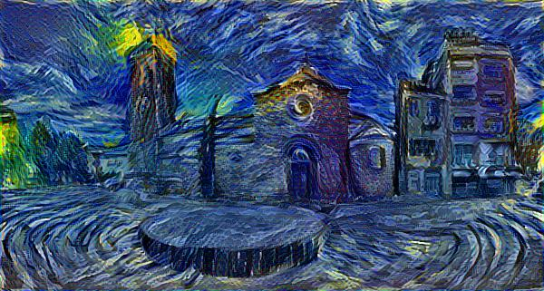

# Neural art transfer

This is my Tensorflow implementation of the Neural Style Transfer technique described in http://arxiv.org/abs/1508.06576 by Gatys *et al*.

The implementation of this technique has been a very good way to learn Tensorflow. I have based my VGG model on the one provided [here](http://www.cs.toronto.edu/~frossard/post/vgg16/) by Davi Frossard.

The optimizer used to create the image that mixes content and style is Adam, and average pooling is used in the VGG network.
Following other artistic style implementations I have also added a total variaton loss to the final loss, but it is disabled by default.

## Usage

First of all you'll need to download the pre-trained VGG16 weights:

```
cd models
./get_models -m vgg
cd ..
```

Then just call the style transfer script:
```
python style-transf.py --cont CONTENT_IMAGE --style STYLE_IMAGE
```

## Script arguments
The available params for the script are the following ones:
- **--iter**: Number of iterations. Default: 1000
- **--cont**: Path of the content image. Default: input/1-content.jpg
- **--style**: Path of the style image. Default: input/1-style.jpg
- **--style**: Path of the output image
- **--lr**: Learning rate. Default: 1.0
- **--cont_w**: Weight of the content loss. Default 1e0
- **--style_w**: Weight for the style loss. Default 1e3
- **--tv_w**: Weight for the total variation loss. Default 0
- **--cont_size**: Set the larger dimension of the content image to the given size. The other dimension is resized accordingly. Note that the output mage will have the same size as the content image. Default None
- **--style_size**: Set the larger dimension of the style image to the given size. The other dimension is resized accordingly. Default None


## Dependencies
To use the script it is needed:
* Tensorflow
* Numpy & Scipy
* PIL

## Examples





## To Do
- [ ] Content and style layers as arguments 
- [ ] Select model (VGG and Alexnet)
